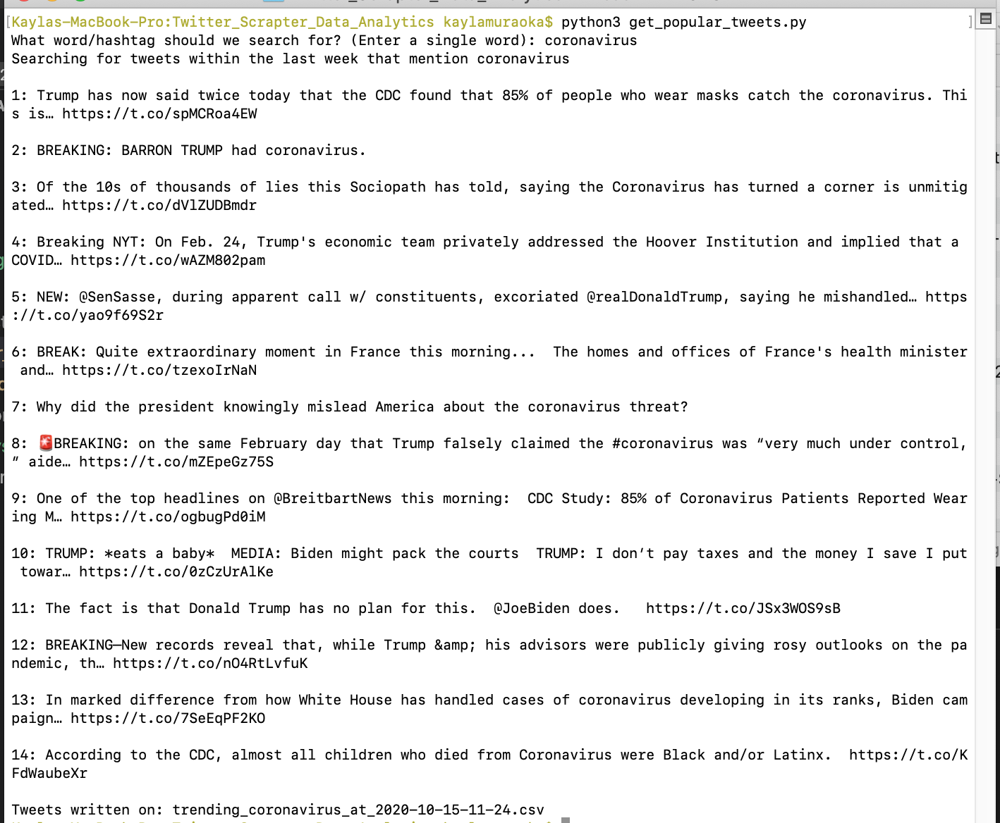
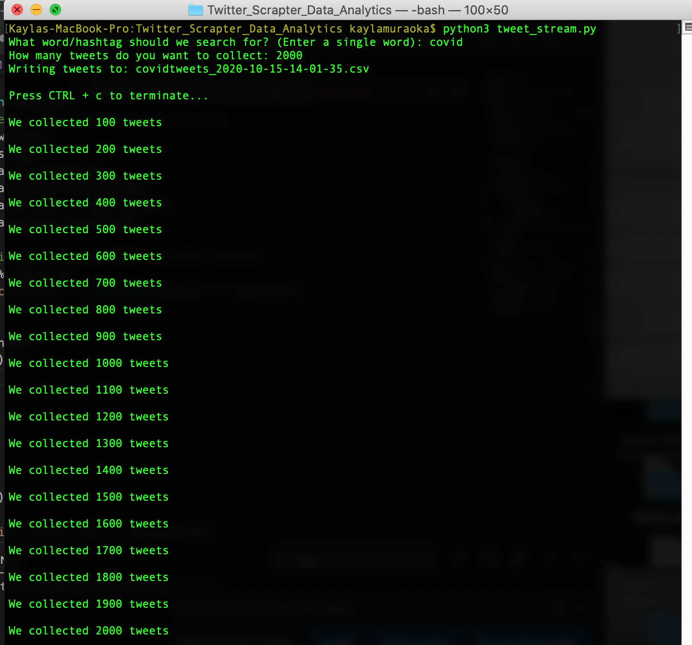
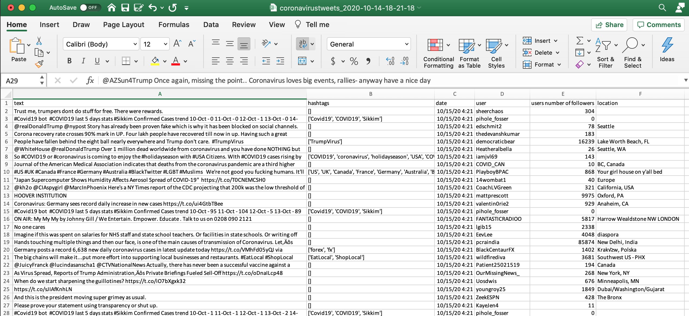
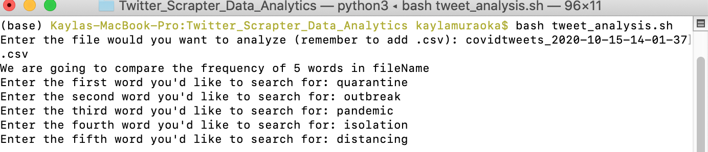
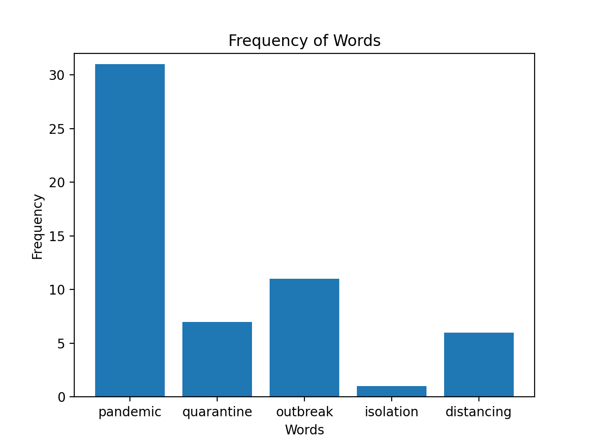

# Twitter_Scrapter_Data_Analytics

## Description

In this project we learned how to tackle writing code in python, in addition to putting our shell scripting abilities to the test. We chose to do this project because we noticed the recent escalation of tweets mentioning the COVID-19/CoronaVirus. Therefore, we wrote several independent programs/scripts that ultimately, facilitates the analysis of tweets pulled from twitter using an API.

## Part A: Grabbing Popular Tweets

In order to scrape tweets from Twitter we utilized a Twitter API. We learned that an API (Application Programming Interface) is a collection of protocols and subroutines for building software. The twitter API gave me access to the tweets according to a series of search queries. We learned that the twitter API uses private key authentication to authenticate all endpoints. We wrote and implemented a python code (the one below) to retrieve all the tweets that may contain a certain word or hashtag specified by the user. The task is performed by calling the python file. The tweets are redirected to a csv file named accordingly to the users search query 'trending*' + query + '\_at*' + time.strftime('%Y-%m-%d-%H-%M') + '.csv' (for example: if I searched for the term coronavirus, the output file would be named trending_coronavirus_at_2020-10-14-15-56.csv) and placed within the same directory as the python file. For reference, you can view the [trending_coronavirus_at_2020-10-14-15-56.csv](trending_coronavirus_at_2020-10-14-15-56.csv) file in this repository.

### Instructions:

1. This task is performed by calling:
   python get_popular_tweets.py
   This is what should happen when executed:
   

2. The tweets are also sent to an output csv file that is created in the same directory and looks as follows:
   

## Part B: Using Tweepy Stream Listener

We created a tweet*stream.py file that collects all live tweets (excluding retweets) mentioning the search qurey inputed by the user.
The script also outputs a csv file to the same directory called query + 'tweets' + '*' + time.strftime('%Y-%m-%d-%H-%M-%S') + '.csv' (for example: if I searched for the term covid, the output file would be named covidtweets_2020-10-15-14-01-37.csv). For reference, you can view the [covidtweets_2020-10-15-14-01-37.csv](covidtweets_2020-10-15-14-01-37.csv) file in this repository.

### Instructions:

1. This task is performed by calling:
   python tweet_stream.py
   This is what should happen when executed:
   
2. The tweet stream are also being sent to an output csv file that is created in the same directory and looks as follows:
   

## Part C: Analysis of tweets

This part features a script in shell that asks the user for five different words of his/her choice and displays a bar chart of how many tweets in the output file of tweet_stream.py (for this example we use the [covidtweets_2020-10-15-14-01-37.csv](covidtweets_2020-10-15-14-01-37.csv)) contain each of those words.

### Instructions:

1. The shell script is named tweet_analysis.sh. Run this script from terminal by the prompt: bash tweet_analysis.sh
2. It prompts the user for the text file the user wants the code to read. For example, enter ‘covidtweets_2020-10-15-14-01-37.csv’(without quotations).
3. The shell script then prompts the user to enter five words that the user would like to check the frequency of (how many tweets in the file contain the word).
   
4. The shell script then runs a python program called bargraphing.py; this program uses the matplotlib library to create the bar chart. The output should look like:
   
5. If at any time you would like to exit, press ctrl C.

## Installaion

Before we start
If you are a Windows User, make sure you installed a Linux virtual machine

For LINUX VITUAL MACHINE USERS:

Open the terminal and execute these commands:
sudo apt-get install python-pip
sudo pip install tweepy
sudo apt-get install vim

For MAC USERS
Download this file: https://bootstrap.pypa.io/get-pip.py you can do this from the command line by executing curl https://bootstrap.pypa.io/get-pip.py --output get-pip.py
Go to that folder and type: sudo python get-pip.py
Execute this: sudo pip install --ignore-installed pip setuptools
Execute this: sudo pip install --ignore-installed tweepy

Then Download the files tweet_stream.py, get_popular_tweets.py and config.cfg
Place them in the same directory

Set up a Twitter developer account:
To be able to use the Twitter APIs, you’ll need to register as a Twitter app developer and obtain keys and access tokens
Start by going to https://apps.twitter.com/:
Sign in using your Twitter account
Click on “create new app”
Click on your app name
Click on “Keys and Access Tokens”
In this page, you’ll find a consumer_key, consumer_secret, access_token, and access_token_secret
Copy your keys and tokens into the placeholders on config.cfg

## Execution

You should be able to execute the following commands from your command line (make sure you are in the directory contianing the downloaded files):
python get_popular_tweets.py
python tweet_stream.py
bash tweet_analysis.sh

## License

This project is licensed under [**GNU GPL v3**](https://choosealicense.com/licenses/gpl-3.0/).
